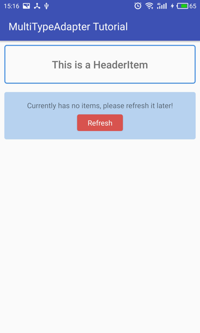
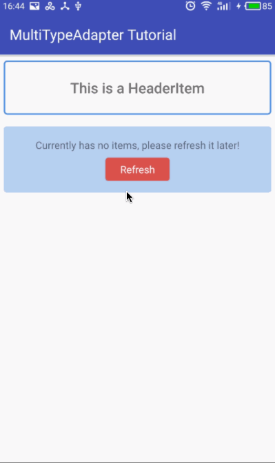
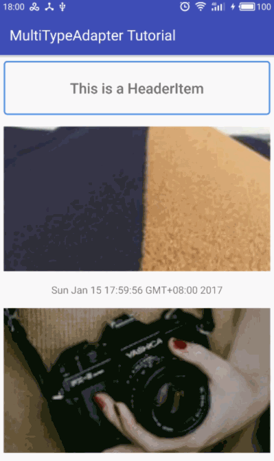
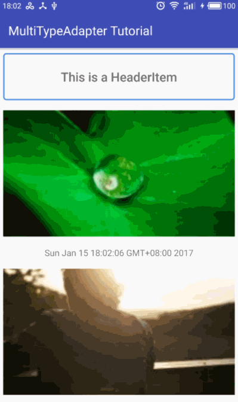
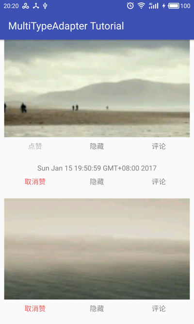
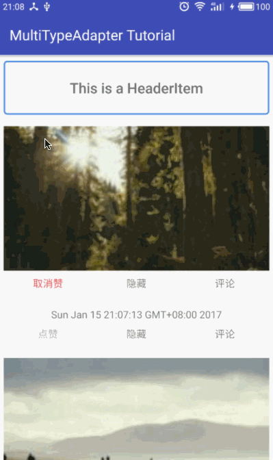
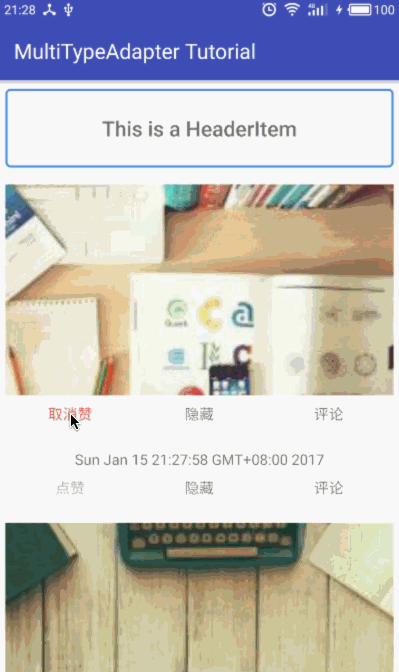
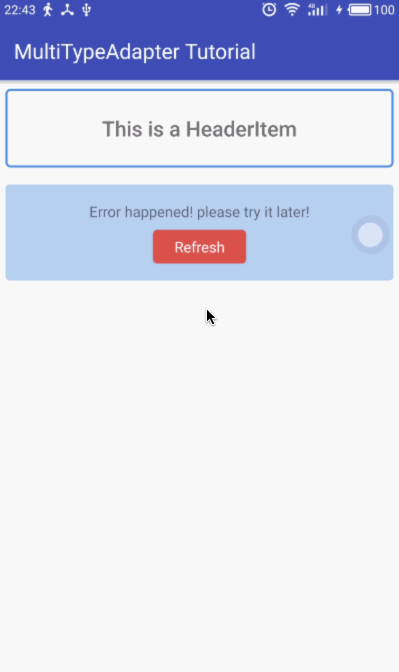
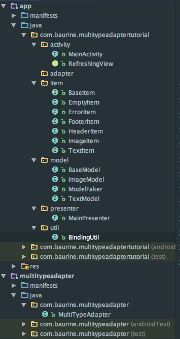

# 借助 android databinding 框架，逃离 adapter 和 viewholder 的噩梦 (2)

## 大纲

1. [实现篇](./multi-type-adapter-tutorial-1.md#实现篇)
   1. [一步一步实现极简的 adapter](./multi-type-adapter-tutorial-1.md#一步一步实现极简的-adapter)

1. [使用篇](#使用篇)
   1. [设置 RecyclerView 和 SwipeRefreshLayout](#设置-recyclerView-和-swipeRefreshLayout)
   1. [实现各种状态类 item](#实现各种状态类-item)
   1. [实现刷新](#实现刷新)
   1. [实现加载更多](#实现加载更多)
   1. [为 item 增加事件处理](#为-item-增加事件处理)
   1. [获取 item 的 position](#获取-item-的-position)
   1. [item 与 model 的关系](#item-与-model-的关系)

1. [优化篇](#优化篇)
   1. [将 adapter 独立成库](#将-adapter-独立成库)
   1. [使用 MVP 简化 Activity 的逻辑](#使用-mvp-简化-activity-的逻辑)

1. [总结篇](#总结篇)

------------------------

## 使用篇

### 设置 RecyclerView 和 SwipeRefreshLayout

在[上一篇](./multi-type-adapter-tutorial-1.md)中我们把 adapter 一步一步实现了，我们终于可以开始使用它了。那么接下来我们就来看看如何使用它。首先登场的当然是 RecyclerView 和 SwipeRefreshLayout 啦，我们在 `activity_main.xml` 用一个 SwipeRefreshLayout 包裹一个 RecyclerView。如下所示：

    // activity_main.xml
    <?xml version="1.0" encoding="utf-8"?>
    <layout
        xmlns:android="http://schemas.android.com/apk/res/android">

        <data>
        </data>

        <android.support.v4.widget.SwipeRefreshLayout
            android:id="@+id/swipe_refresh_layout"
            android:layout_width="match_parent"
            android:layout_height="match_parent">

            <android.support.v7.widget.RecyclerView
                android:id="@+id/recycler_view"
                android:layout_width="match_parent"
                android:layout_height="match_parent"/>

        </android.support.v4.widget.SwipeRefreshLayout>
    </layout>

然后在 MainActivity 中，分别对 SwipeRefreshLayout 和 RecyclerView 进行初始化，为 SwipeRefreshLayout 加上刷新的功能，为 RecyclerView 设置 adapter，
我们监听 RecyclerView 的滚动事件，当快要滚动要最底部时，去加载更多数据。代码如下所示：

    // MainActivity.java
    public class MainActivity extends AppCompatActivity {
        private MultiTypeAdapter adapter = new MultiTypeAdapter();
        private SwipeRefreshLayout swipeRefreshLayout;
        private RecyclerView recyclerView;

        @Override
        protected void onCreate(Bundle savedInstanceState) {
            super.onCreate(savedInstanceState);
            ActivityMainBinding binding =
                    DataBindingUtil.setContentView(this, R.layout.activity_main);

            swipeRefreshLayout = binding.swipeRefreshLayout;
            recyclerView = binding.recyclerView;
            initViews();
        }

        private void initViews() {
            swipeRefreshLayout.setOnRefreshListener(
                    new SwipeRefreshLayout.OnRefreshListener() {
                        @Override
                        public void onRefresh() {
                            refreshData();
                        }
                    });

            recyclerView.setHasFixedSize(true);
            final LinearLayoutManager llm = new LinearLayoutManager(this);
            recyclerView.setLayoutManager(llm);
            recyclerView.addOnScrollListener(new RecyclerView.OnScrollListener() {
                @Override
                public void onScrollStateChanged(RecyclerView recyclerView, int newState) {
                    if (newState == RecyclerView.SCROLL_STATE_IDLE &&
                            llm.findLastVisibleItemPosition() >= adapter.getItemCount() - 1) {
                        loadMoreData();
                    }
                }
            });
            recyclerView.setAdapter(adapter);
        }

        private void loadMoreData() {
            // TODO
        }

        private void refreshData() {
            // TODO
        }
    }

### 实现各种状态类 item

接着，我们就该往 adapter 填充数据了，也就是各种 item。上一篇也讲到，我们的重心将从实现一个又一个的 viewholder 转移到实现一个又一个的 item，那么来看看有这个例子中有哪些 item，分为两大类：

1. 非数据 item，状态型 item
   - HeaderItem
   - EmptyItem
   - ErrorItem
   - FooterItem: loading / error / no more data

2. 数据 item
   - ImageItem
   - TextItem
   
HeaderItem 如果展示的是动态的数据，就可以当成是数据 item，FooterItem 中有三种状态，其实也是可以拆成三种单独的 item，但我觉得合起来稍微方便一点。

ImageItem 和 TextItem 这两种数据型 item 在上一篇中已经实现了，所以我们来把这些剩下的状态型 item 实现。 

- HeaderItem 的内容很简单，就显示一行固定的字符串。
- 当刷新没有数据时，我们显示 EmptyItem，EmptyItem 有一行字符，和一个按钮，点击按钮后再次触发刷新，事件处理的功能我们稍候再说。
- 当刷新操作遇到错误时，显示 ErrorItem，显示错误原因，及一个刷新按钮 (当然，你也可以把 EmptyItem 和 ErrorItem 统一成一个 Item，把 empty 当成一种错误原因)。
- FooterItem，用来在加载更多时显示三种结果状态：加载中，加载失败，没有更多数据了。其中加载失败的情况下提供了一个重试按钮。

HeaderItem:

    // HeaderItem.java
    public class HeaderItem implements MultiTypeAdapter.IItem {
        @Override
        public int getType() {
            return R.layout.item_header;
        }
    }

    // item_header.xml
    <layout
        xmlns:android="http://schemas.android.com/apk/res/android">

        <data>
            <variable
                name="item"
                type="com.baurine.multitypeadaptersample.item.HeaderItem"/>
        </data>

        <LinearLayout
            android:layout_width="match_parent"
            android:layout_height="wrap_content"
            android:layout_margin="8dp"
            android:background="@drawable/x_border"
            android:gravity="center_horizontal"
            android:orientation="vertical">

            <TextView
                android:layout_width="wrap_content"
                android:layout_height="wrap_content"
                android:padding="24dp"
                android:text="This is a HeaderItem"
                android:textSize="20sp"
                android:textStyle="bold"/>

        </LinearLayout>
    </layout>

EmptyItem:

    // EmptyItem.java
    public class EmptyItem implements MultiTypeAdapter.IItem {
        @Override
        public int getType() {
            return R.layout.item_empty;
        }

        /////////////////////////////////////////////////
        public EmptyItem() {
            content = "Currently has no items, please refresh it later!";
        }

        /////////////////////////////////////////////////
        // data part
        private final String content;

        public String getContent() {
            return content;
        }
    }

    // item_empty.xml
    <layout
        xmlns:android="http://schemas.android.com/apk/res/android">

        <data>
            <variable
                name="item"
                type="com.baurine.multitypeadaptertutorial.item.EmptyItem"/>
        </data>

        <LinearLayout
            android:layout_width="match_parent"
            android:layout_height="wrap_content"
            android:layout_margin="8dp"
            android:background="@drawable/x_bg"
            android:gravity="center"
            android:orientation="vertical"
            android:padding="16dp">

            <TextView
                android:layout_width="wrap_content"
                android:layout_height="wrap_content"
                android:text="@{item.content}"/>

            <Button
                android:layout_width="wrap_content"
                android:layout_height="32dp"
                android:layout_marginTop="8dp"
                android:background="@drawable/x_btn_bg"
                android:text="Refresh"
                android:textAllCaps="false"
                android:textColor="#ffffff"/>
        </LinearLayout>
    </layout>

ErrorItem 和 EmptyItem 类似，这里就不贴代码了。接下来看 FooterItem，因为它有三种状态，所以在 xml 中，必须根据它的状态来显示或隐藏一些 View，我们用三目表达式来实现，比如 `android:visibility="@{item.loading ? View.VISIBLE : View.GONE}"`，完整代码如下：

    // FooterItem.java
    public class FooterItem implements MultiTypeAdapter.IItem {
        @Override
        public int getType() {
            return R.layout.item_footer;
        }

        ///////////////////////////////////////////////
        public FooterItem setState(int state) {
            this.state = state;
            return this;
        }

        ///////////////////////////////////////////////
        // data part
        // FooterItem has 3 states: Loading, Error, NoMore
        public final static int LOADING = 0;
        public final static int ERROR = 1;
        public final static int NO_MORE = 2;
        private int state = LOADING;

        public boolean isLoading() {
            return state == LOADING;
        }

        public boolean isError() {
            return state == ERROR;
        }

        public boolean isNoMore() {
            return state == NO_MORE;
        }
    }

    // item_footer.xml
    <layout
        xmlns:android="http://schemas.android.com/apk/res/android">

        <data>
            <import type="android.view.View"/>
            <variable
                name="item"
                type="com.baurine.multitypeadaptertutorial.item.FooterItem"/>
        </data>

        <FrameLayout
            android:layout_width="match_parent"
            android:layout_height="wrap_content"
            android:layout_margin="8dp">

            <!-- LOADING state-->
            <ProgressBar
                style="?android:attr/progressBarStyle"
                android:layout_width="wrap_content"
                android:layout_height="wrap_content"
                android:layout_gravity="center_horizontal"
                android:layout_margin="8dp"
                android:visibility="@{item.loading ? View.VISIBLE : View.GONE}"/>

            <!-- NO_MORE state -->
            <TextView
                android:layout_width="wrap_content"
                android:layout_height="wrap_content"
                android:layout_gravity="center_horizontal"
                android:layout_margin="8dp"
                android:text="~~~~~~ No more data! ~~~~~~"
                android:visibility="@{item.noMore ? View.VISIBLE : View.GONE}"/>

            <!-- ERROR state -->
            <LinearLayout
                android:layout_width="match_parent"
                android:layout_height="wrap_content"
                android:gravity="center"
                android:visibility="@{item.error ? View.VISIBLE : View.GONE}">

                <TextView
                    android:layout_width="wrap_content"
                    android:layout_height="wrap_content"
                    android:text="Some error happened! please retry later!"/>

                <Button
                    android:layout_width="wrap_content"
                    android:layout_height="32dp"
                    android:layout_marginLeft="8dp"
                    android:background="@drawable/x_btn_bg"
                    android:text="Retry"
                    android:textAllCaps="false"
                    android:textColor="#ffffff"/>
            </LinearLayout>

        </FrameLayout>
    </layout>

这里，我们使用了一个小技巧，在实现 `setState()` 方法时，我们没有像往常一样返回 void 值，而是返回了该对象自身，这样，我们就可以实现下面这样的简化：

    // before
    footerItem.setState(FooterItem.NO_MORE);
    adapter.addItem(footerItem);

    // after
    adapter.addItem(footerItem.setState(FooterItem.NO_MORE));

接下来，我们来初始化这些 item，因为像这些状态型的 item，它们的内容并不是动态的，而是固定不变的，因此不需要每次都 new 一个新的实例，我们只需要在 `onCreate()` 的时候初始化一次就行了。

我们在 `initItems()` 中创建这些 items，并在初始时显示 headerItem 和 emptyItem。之后 headerItem 是始终显示的。

    // MainActivity.java
    @Override
    protected void onCreate(Bundle savedInstanceState) {
        // ...
        initItems();
    }

    private void initItems() {
        headerItem = new HeaderItem();
        emptyItem = new EmptyItem();
        errorItem = new ErrorItem();
        footerItem = new FooterItem();
        adapter.addItem(headerItem);
        adapter.addItem(emptyItem);
    }

截止到目前的代码：[`tutorial_step_5`](https://github.com/baurine/multi-type-adapter/tree/tutorial_step_5)

目前的效果：

### 实现刷新 

接下来我们来实现刷新。我们用 `refreshing` 变量来标志当前是否处于刷新状态。用 handler 的 `postDelay` 方法来模拟网络请求，用随机数来模仿返回的三种结果：空，错误，正常。

因为 `loadMoreData()` 和 `refreshData()` 都要进行网络请求获取数据，因此我们把这部分共同的逻辑封装在 `fetchData(boolean loadMore)` 中。

先看 `refreshData()` 的代码：

    // MainActivity.java
    private void refreshData() {
        if (!refreshing) {
            refreshing = true;
            swipeRefreshLayout.setRefreshing(true);
            // remove all other items, just keep headerItem
            adapter.setItem(headerItem);
            fetchData(false);
        }
    }

- 首先，为避免多次刷新，我们首先要判断当前处于非刷新状态，我们才进行刷新。
- 其次，虽然目前我们触发刷新的途径只有一种，那就是手动下拉 swipeRefreshLayout，此时 swipeRefreshLayout 已经处于刷新状态了，本可以无须再调用 `swipeRefreshLayout.setRefreshing(true)` 了，但我们还可能有其它触发刷新的入口，比如点击 EmptyItem 和 ErrorItem 的刷新按钮，所以，这里再调用 `swipeRefreshLayout.setRefreshing(true)`，让其呈现刷新状态。
- 然后，刷新时我们清空除 headerItem 外的所有数据，所以 `setItem(headerItem)`，但我们不想马上让所有 item 从 UI 上消失，而是想等结果回来之后再更新 UI，因此，在 `setItem` 后，我们没有马上调用 `notityDataSetChanged()`，而是等请求返回后再 `notifyDataSetChanged()`。
- 最后，调用 `fetchData(false)` 进行真正的数据请求。

再看 `fetchData()` 的代码：

    // MainActivity.java
    // fetch data from server, for refreshing or load more
    private void fetchData(final boolean loadMore) {
        // mock network request
        new Handler().postDelayed(new Runnable() {
            @Override
            public void run() {
                if (refreshing) {
                    refreshing = false;
                    swipeRefreshLayout.setRefreshing(false);
                }

                retrieveItems(loadMore);
                adapter.notifyDataSetChanged();
            }
        }, 2000);
    }

- 我们用 `handler.postDelayed()` 来模拟网络请求。
- 请求返回时，如果当前处于刷新状态 (因为还可能是处于加载更多的状态)，则置 refreshing 为 false，并取消 swipeRefreshLayout 的刷新状态。
- 我们在 `retrieveItems()` 中处理返回的数据，创建 item，加到 adapter 中。
- 最后调用 `notifyDataSetChanged()` 刷新 recyclerView。

那么接下来看看 `retrieveItems()` 是怎么实现的：

    // MainActivity.java
    private void retrieveItems(boolean loadMore) {
        // result = 0, network error
        // result = 1, empty or last page data
        // result = 2 and other, normal result
        int resultType = (new Random()).nextInt(100) % 4;
        if (resultType == 0) {
            adapter.addItem(errorItem);
        } else if (resultType == 1) {
            adapter.addItem(emptyItem);
        } else {
            addDataItems(PER_PAGE_COUNT);
            // pre-display loading state to improve user experience
            adapter.addItem(footerItem.setState(FooterItem.LOADING));
        }
    }

- 我们使用随机值来模拟三种结果：网络错误，数据为空，正常结果。
- 当结果是网络错误时，我们给 adapter 加上 errorItem，还记得前面刷新时的逻辑吗，刷新时我们清空了 adapter 里除 headerItem 外的所有的 item，所以加上 errorItem 后，页面上就只有 headerItem 和 errorItem 了。
- 当结果是数据为空时，我们给 adapter 加上 emptyItem。
- 当结果正常时，一般来说，每次网络请求，返回的结果数是固定的，我们用一个 `PER_PAGE_COUNT` 来定义它，如果返回的结果数小于这个值，那么说明这已经是最后一页了。因此，这里我们给 adapter 加上 `PER_PAGE_COUNT` 个数据 item，我们在 `addDataItems(int count)` 来处理它。
- 当添加完正常的数据 item 后，我们在它的最后再加上了 loading 状态的 footerItem，这样做的好处是不言而喻的，提高了用户体验。我以前的做法是，是在快要滚动在 recyclerView 的底部时，我在这时才给 adapter 加一个 loading 的 viewholder，这时，界面很明显会卡一下的。我们提前把这个效果显示出来，就可以消除这种卡顿。

最后，经过这么一层一层又一层的封装，我们终于抵达了最核心也是最简单的一步，给 adapter 添加数据 item，我们用一个 for 循环给 adapter 加上一些数据 item：

    private void addDataItems(int count) {
        for (int i = 0; i < count; i++) {
            adapter.addItem(i % 2 == 0 ? new ImageItem() : new TextItem());
        }
    }

截止到目前的代码：[`tutorial_step_6`](https://github.com/baurine/multi-type-adapter/tree/tutorial_step_6)

此时的效果：

### 实现加载更多

接下来，我们先不着急实现 EmptyItem 和 ErrorItem 上的按钮点击事件。我们先来继续实现 `loadMoreData()`。我们同样使用一个叫 `loading` 的变量来判断当前是否处于 loading 状态，我们再额外定义一个 `hasMoreData` 的变量，来定义是否还有更多的数据，如果没有更多的数据，我们直接放弃请求，以避免做一些无用功。

    private void loadMoreData() {
        if (hasMoreData &&
                !loading &&
                // here the threshold depends on your actual situation
                // adapter.getItemCount() > PER_PAGE_COUNT
                adapter.getItemCount() > 2) {
            loading = true;
            fetchData(true);
        }
    }

- 同时，我们增加一个额外判断，当当前的 item 数大于某个阈值时才允许 loadMore，这个取决于你的实际情况，增加这个是为了避免一启动就进入 loadMore 状态。

我们修改 `fetchData()` 方法，增加对 loadMore 情况的处理，在 `retrieveItems` 前面加入下面这段代码：

    if (loadMore) {
        loading = false;
        adapter.removeItem(footerItem);
    }
    retrieveItems(loadMore);

- 当 loadMore 的请求返回时，将 loading 状态置 false，同时，我们要把 footerItem 从 adapter 中移除，因为我们要在 `retrieveItems()` 先给 adapter 添加数据型 item ，然后再把 footerItem 加回去。

然后我们修改 `retrieveItems()` 函数，增加对 loadMore 情况的处理。

    private void retrieveItems(boolean loadMore) {
        // result = 0, network error
        // result = 1, empty or last page data
        // result = 2 and other, normal result
        int resultType = (new Random()).nextInt(100) % 4;
        if (resultType == 0) {
            adapter.addItem(loadMore ? footerItem.setState(FooterItem.ERROR) : errorItem);
        } else if (resultType == 1) {
            if (loadMore) {
                hasMoreData = false;
                addDataItems(PER_PAGE_COUNT / 2);
                // here depends whether you want to display no more data state
                // if you don't want to display this state when has no more data
                // then just don't add it back
                adapter.addItem(footerItem.setState(FooterItem.NO_MORE));
            } else {
                adapter.addItem(emptyItem);
            }
        } else {
            addDataItems(PER_PAGE_COUNT);
            // pre-display loading state to improve user experience
            adapter.addItem(footerItem.setState(FooterItem.LOADING));
        }
    }

- 在 loadMore 情况下，当网络错误时，我们给 adapter 增加一个 error 状态的 footerItem。
- 当结果是最后一页，没有更多结果时，我们设置 `hasMoreData` 为 false，并只添加 `PER_PAGE_COUNT/2` 个 item，最后，再加上一个 `NO_MORE` 状态的 footerItem。
- 当返回正常结果时，逻辑和 refresh 时相同。

同时，我们还要修改一下 `refreshData()` 方法，当 refreshing 时，要把 `hasMoreData` 重置为初始值 true。

    private void refreshData() {
        if (!refreshing) {
            refreshing = true;
            hasMoreData = true;
            swipeRefreshLayout.setRefreshing(true);
            // remove all other items, just keep headerItem
            adapter.setItem(headerItem);
            fetchData(false);
        }
    }

截止到目前的代码：[`tutorial_step_7`](https://github.com/baurine/multi-type-adapter/tree/tutorial_step_7)

此时效果：

### 为 item 增加事件处理

完成了 refreshData 和 loadMoreData 后，我们是时候考虑如何处理这些 item 上的点击事件了。EmptyItem 和 ErrorItem 上有刷新事件，FooterItem 上有重试事件。我们还想给 ImageItem 和 TextItem 加上 点赞/隐藏/评论 三个点击事件。

我们先来考虑复杂的，为 ImageItem 和 TextItem 增加 点赞/隐藏/评论 三个按钮 (实际我用 TextView 替代了 Button)。我们把这个共同的部分放到一个 `include_actions.xml` 中，然后让 `item_image.xml` 和 `item_text.xml` include 它。

我们先来初步实现 `include_actions.xml`：

    <layout
        xmlns:android="http://schemas.android.com/apk/res/android">
        <data>
            <variable
                name="liked"
                type="Boolean"/>
        </data>

        <LinearLayout
            android:layout_width="match_parent"
            android:layout_height="wrap_content">

            <TextView
                android:id="@+id/tv_like"
                android:layout_width="0dp"
                android:layout_height="wrap_content"
                android:layout_weight="1"
                android:gravity="center"
                android:onClick="@{ ??? }"
                android:paddingTop="8dp"
                android:paddingBottom="8dp"
                android:text="@{liked ? `取消赞` : `点赞`}"
                android:textColor="@{liked ? @android:color/holo_red_light : @android:color/darker_gray}"/>

            <TextView
                android:id="@+id/tv_hide"
                android:layout_width="0dp"
                android:layout_height="wrap_content"
                android:layout_weight="1"
                android:gravity="center"
                android:onClick="@{ ??? }"
                android:paddingTop="8dp"
                android:paddingBottom="8dp"
                android:text="隐藏"/>

            <TextView
                android:id="@+id/tv_comment"
                android:layout_width="0dp"
                android:layout_height="wrap_content"
                android:layout_weight="1"
                android:gravity="center"
                android:onClick="@{ ??? }"
                android:paddingTop="8dp"
                android:paddingBottom="8dp"
                android:text="评论"/>
        </LinearLayout>
    </layout>

然后我们该考虑，这些 `android:onClick` 事件该和什么绑定呢？我们是不是应该定义一个专门的 Handler 来处理这三种事件，比如：

    public interface FeedHandler {
        void onLike();
        void onHide();
        void onComment();
    }

然后在 xml 中设置一个 handler 的 variable，如下所示：

    <variable
        name="handler"
        type="FeedHandler"/>

然后分别给这三个 `android:onClick` 绑定 `"@{handler::onLike}"`，`"@{handler::onHide}"`，`"@{handler::onComment}"`。我觉得这样做很烦，每一种 item 都要定义这样的 handler，不够通用。实际上我们可以直接使用 View.OnClickListener 这个 handler。因为在 OnClickListener 的 `onClick(View view)` 这个方法中，我们可以得到触发此事件的 view，在上层通过 view 的 id 来区分不同的事件 (我们需要给这些 view 指定 id 属性)。因此，我们为此 xml 设置一个 type 为 View.OnClickListener 的 variable，如下所示：

    <variable
        name="onClickListener"
        type="android.view.View.OnClickListener"/>
      
并给三个 `android:onClick` 都绑定 `"@{onClickListener::onClick}"` 处理方法，即 `android:onClick="@{onClickListener::onClick}"`。

`item_image.xml` 和 `item_text.xml` include `include_actions.xml` 时，要能够为 `include_actions.xml` 提供 liked 和 onClickListener 属性，这就意味着 ImageItem 和 TextItem 必须要有 liked 和 onClickListener 属性。鉴于大部分的 item，只要是有点击事件的 item，都需要有一个 onClickListener 成员，我们定义一个基类 BaseItem：

    // BaseItem.java
    public abstract class BaseItem implements MultiTypeAdapter.IItem {
        ////////////////////////////////////////////
        // handle event
        private View.OnClickListener onClickListener;

        public View.OnClickListener getOnClickListener() {
            return onClickListener;
        }

        public void setOnClickListener(View.OnClickListener onClickListener) {
            this.onClickListener = onClickListener;
        }
    }

我们修改 ImageItem 和 TextItem，让它们继承自 BaseItem，增加 liked 属性，并增加 `toggleLiked()` 方法，为后面处理点击事件做准备。

ImageItem：

    public class ImageItem extends BaseItem {
        @Override
        public int getType() {
            return R.layout.item_image;
        }

        ////////////////////////////////////////////////
        public final String url;
        private boolean liked;

        public ImageItem() {
            url = "https://unsplash.it/200/200?random&" + new Random().nextInt(40);
            liked = new Random().nextBoolean();
        }

        public boolean isLiked() {
            return liked;
        }

        public void toggleLiked() {
            liked = !liked;
        }
    }

TextItem：

    public class TextItem extends BaseItem {
        @Override
        public int getType() {
            return R.layout.item_text;
        }

        ///////////////////////////////////////////
        public final String content;
        private boolean liked;

        public TextItem() {
            content = new Date().toString();
            liked = new Random().nextBoolean();
        }

        public boolean isLiked() {
            return liked;
        }

        public void toggleLiked() {
            liked = !liked;
        }
    }

接下来，我们就可以在 `item_image.xml` 和 `item_text.xml` 中 include `include_actions.xml` 了，代码是相同的，如下所示：

    <include
        layout="@layout/include_actions"
        app:liked="@{item.liked}"
        app:onClickListener="@{item.onClickListener}"/>

截止到目前的代码：[`tutorial_step_8`](https://github.com/baurine/multi-type-adapter/tree/tutorial_step_8)

此时的效果：

但是目前只是显示了这些按钮，点击并没有反应，那么接下来我们就来实现这些事件处理方法。我们在 `addDataItems()` 方法中为刚创建出来的 ImageItem 和 TextItem 设置 OnClickListener，如下所示：

    private void addDataItems(int count) {
        for (int i = 0; i < count; i++) {
            MultiTypeAdapter.IItem item = i % 2 == 0 ? new ImageItem() : new TextItem();
            if (item instanceof ImageItem) {
                final ImageItem imageItem = (ImageItem) item;
                imageItem.setOnClickListener(new View.OnClickListener() {
                    @Override
                    public void onClick(View view) {
                        switch (view.getId()) {
                            case R.id.tv_like:
                                imageItem.toggleLiked();
                                adapter.notifyDataSetChanged();
                                break;
                            case R.id.tv_hide:
                                adapter.removeItem(imageItem);
                                adapter.notifyDataSetChanged();
                                break;
                            case R.id.tv_comment:
                                // TODO: jump to another activity
                                break;
                        }
                    }
                });
                adapter.addItem(imageItem);
            } else {
                final TextItem textItem = (TextItem) item;
                textItem.setOnClickListener(new View.OnClickListener() {
                    @Override
                    public void onClick(View view) {
                        switch (view.getId()) {
                            case R.id.tv_like:
                                textItem.toggleLiked();
                                adapter.notifyDataSetChanged();
                                break;
                            case R.id.tv_hide:
                                adapter.removeItem(textItem);
                                adapter.notifyDataSetChanged();
                                break;
                            case R.id.tv_comment:
                                // TODO: jump to another activity
                                break;
                        }
                    }
                });
                adapter.addItem(textItem);
            }
        }
    }

哇，好大一坨代码，简直是丑爆了，如果再加几种 Item，那这代码简直没法看了，必须优化。其实对于上层来说，它不应该知道每种 Item 内部都有哪些 view id，而每种 Item 却必须知道自己有哪些 view id，所以，很明显，这部分的逻辑必须移动每个 Item 内部处理，我们修改 ImageItem 和 TextItem 的构造函数，代码是类似的，这里只演示 ImageItem：

    public ImageItem(final MultiTypeAdapter adapter) {
        url = "https://unsplash.it/200/200?random&" + new Random().nextInt(40);
        liked = new Random().nextBoolean();

        setOnClickListener(new View.OnClickListener() {
            @Override
            public void onClick(View view) {
                switch (view.getId()) {
                    case R.id.tv_like:
                        toggleLiked();
                        adapter.notifyDataSetChanged();
                        break;
                    case R.id.tv_hide:
                        adapter.removeItem(ImageItem.this);
                        adapter.notifyDataSetChanged();
                        break;
                    case R.id.tv_comment:
                        // TODO: jump to another activity
                        break;
                }
            }
        });
    }

addDataItems 可以再次简化成一行核心代码：

    private void addDataItems(int count) {
        for (int i = 0; i < count; i++) {
            adapter.addItem(i % 2 == 0 ? new ImageItem(adapter) : new TextItem(adapter));
        }
    }

截止到目前的代码：[`tutorial_step_9`](https://github.com/baurine/multi-type-adapter/tree/tutorial_step_9)

此时的效果：

### 获取 item 的 position

item 移除的动画看着有点突兀，这是因为我们全是调用了 notifyDataSetChanged 来通知变化的。如果我们想用 notifyItemRemoved 来通知 item 被移除的变化呢，我们必须得知道这个 item 在 adapter 中的 position。我们给 adapter 增加一个 `findPos(item)` 的方法，并修改 `removeItem(item)` 方法，让返回值由 void 变成 int，如下所示：

    public int findPos(IItem item) {
        return items.indexOf(item);
    }

    public int removeItem(IItem item) {
        int pos = findPos(item);
        items.remove(item);
        return pos;
    }

这样，我们就可以使用 notifyItemRemoved 和 notifyItemChanged 来替代 notifyDataSetChanged 了，如下所示：

    case R.id.tv_like:
        toggleLiked();
        adapter.notifyItemChanged(adapter.findPos(ImageItem.this));
        break;
    case R.id.tv_hide:
        adapter.notifyItemRemoved(adapter.removeItem(ImageItem.this));
        break;

截止到目前的代码：[`tutorial_step_10`](https://github.com/baurine/multi-type-adapter/tree/tutorial_step_10)

此时的效果：

接下来我们给 EmptyItem / ErrorItem / FooterItem 增加事件处理方法。我们同样让它们继承自 BaseItem。但它们和 ImageItem/TextItem 又有点不一样，它们的点击事件需要调用 MainActivity 的 refreshData 方法，如果在 Item 内部处理，那么它们需要持有 MainActivity 对象，不是那么优雅，鉴于它们只有一个点击事件，不需要判断 view id，我们稍微做一些妥协，在 MainActivity 中为它们 setOnClickListener，代码如下所示：

    private void initItems() {
        headerItem = new HeaderItem();
        emptyItem = new EmptyItem();
        errorItem = new ErrorItem();
        footerItem = new FooterItem();

        emptyItem.setOnClickListener(new View.OnClickListener() {
            @Override
            public void onClick(View view) {
                adapter.notifyItemRemoved(adapter.removeItem(emptyItem));
                refreshData();
            }
        });
        errorItem.setOnClickListener(new View.OnClickListener() {
            @Override
            public void onClick(View view) {
                adapter.notifyItemRemoved(adapter.removeItem(errorItem));
                refreshData();
            }
        });
        footerItem.setOnClickListener(new View.OnClickListener() {
            @Override
            public void onClick(View view) {
                footerItem.setState(FooterItem.LOADING);
                adapter.notifyItemChanged(adapter.findPos(footerItem));
                loading = true;
                fetchData(true);
            }
        });

        adapter.addItem(headerItem);
        adapter.addItem(emptyItem);
    }

然后别忘了在这些 item 对应的 xml 中为 button 的 `android:onClick` 属性绑定处理方法：`android:onClick="@{item.onClickListener::onClick}"`。

截止到目前的代码：[`tutorial_step_11`](https://github.com/baurine/multi-type-adapter/tree/tutorial_step_11)

此时的效果：

如果一个 Item，一部分点击事件需要调用 MainActivity 的方法，一部分不需要，可以在内部处理，那怎么办 (这种需求应该是极少的)，你们可以思考一下。如果是我，我可能会这么做：

- 方法 1，定义一个抽象接口，让 MainActivity 实现这个接口，Item 持有接口对象，其实这是一种 MVP 的架构思想，大致代码如下：

        // MainView.java
        public interface MainView {
            void refreshData();
        }

        // EmptyItem.java
        public EmptyItem(MultiTypeAdapter adapter, MainView mainView) {
            //...

            setOnClickListener(new View.OnClickListener() {
                @Override
                public void onClick(View view) {
                    adapter.notifyItemRemoved(adapter.removeItem(emptyItem));
                    mainView.refreshData();
                }
            });
        }

        // MainActivity.java
        public class MainActivity extends AppCompatActivity implements MainView {
            public void refreshData() {
                //...
            }

            public void initItems() {
                emptyItem = new EmptyItem(adapter, this);
            }
        }

- 方法 2，在 Item 内部定义两个 View.OnClickListener，一个是用于 xml 的内部 listener, 一个是用于给上层回调的外部 listener，所有点击事件先交给内部 listener 处理，能在内部处理的就在内部处理，不能处理的，就通过外部 listener 抛给上层处理，相比方法 1 更繁琐一些，我更倾向于用方法 1，大致代码如下：

        // SampleItem
        private View.OnClickListener internalListener;
        public View.OnClickListener getInternalListener() { return internalListener; }
        private View.OnClickListener externalListener;
        public View.OnClickListener setExternalListener(View.OnClickListener listener) {
            externalListener = listener;
        }

        public SampleItem(MultiTypeAdapter adapter) {
            //...

            internalListener = new View.OnClickListener {
                @Override
                public void onClick(View view) {
                    switch (view.getId()) {
                        case R.id.tv_hide:
                            adapter.notifyItemRemoved(adapter.removeItem(SampleItem.this));
                            break;
                        case R.id.tv_refresh:
                            if (externalListener != null) {
                                externalListener.onClick(view);
                            }
                            break;
                    }
                }
            }
        }

估计有些人又会开始问道怎么设置 OnItemClickListener，我一向的主张是，OnItemClickLister 的存在是没有必要的，直接给 item 最外层的 view 绑定一个 onClick 事件就行了。

### item 与 model 的关系

接下来，我们想讨论一下 Data Model 与 Item 的关系，到目前为止，我们是把 item 当 model 用的，真正的网络请求，返回来的是数据型 model，一个 model 在一个 app 中，可能有多种展示形态，用于不同的布局，因此它应该是可以对应多种 item 的 (而一种 item 应该只对应一种 model，所以它们的关系是一对多)。因此，更好的做法是，我们应该是用 item 来包裹一个原始的 model，而不是直接在 item 里存储多个字段。所以接下来我们把数据从 ImageItem 和 TextItem 中剥离出来，分别用 ImageModel 和 TextModel 来表示，代码如下所示，两者代码类似，只展示 ImageModel 和 ImageItem 的代码：

ImageModel：

    // ImageModel.java
    public class ImageModel {
        public final String url;
        public boolean liked;

        public ImageModel() {
            url = "https://unsplash.it/200/200?random&" + new Random().nextInt(40);
            liked = new Random().nextBoolean();
        }
    }

修改后的 ImageItem：

    public class ImageItem extends BaseItem {
        //...

        ////////////////////////////////////////////////
        private final ImageModel imageModel;

        public ImageItem(final MultiTypeAdapter adapter, ImageModel imageModel) {
            this.imageModel = imageModel;

            setOnClickListener(new View.OnClickListener() {
                //...
            });
        }

        public String getUrl() {
            return imageModel.url;
        }

        public boolean isLiked() {
            return imageModel.liked;
        }

        private void toggleLiked() {
            imageModel.liked = !imageModel.liked;
        }
    }

因为我们修改了 ImageItem/TextItem 的构造函数，所以 `addDataItems()` 也要同步修改，修改如下：

    private void addDataItems(int count) {
        for (int i = 0; i < count; i++) {
            if (i % 2 == 0) {
                ImageModel imageModel = new ImageModel();
                adapter.addItem(new ImageItem(adapter, imageModel));
            } else {
                TextModel textModel = new TextModel();
                adapter.addItem(new TextItem(adapter, textModel));
            }
        }
    }

截止到目前的代码：[`tutorial_step_12`](https://github.com/baurine/multi-type-adapter/tree/tutorial_step_12)

接下来我们想象一下，`addDataItems()` 真实的情况是怎么样的。当我们请求网络返回时，得到的应该是一个 JSON 数组，数组中包含不同类型的对象，对应解析成不同的 model。在 Java 中 (对于 JavaScript 来说这完全不是问题)，我们怎么来区分它们应该解析成什么样的 model，按照客户端和服务端的约定，这些对象应该有一个共同的字段，比如叫 `type`，我们先把 type 的值取出来，比如，如果 type 的值是 "image"，那么我们就把这个对象解析成 ImageModel，如果 type 的值是 "text"，那么就解析成 TextModel，诸如此类。很明显，我们要在一个函数中返回不同的 model，这些 model 必须有一个相同的父类，或是接口。为此，我们定义一个基类 BaseModel，并为它加上几乎所有的 model 都有的 id/createdAt/updatedAt 字段，如下所示：

    // BaseModel.java
    public class BaseModel {
        public int id;
        public Date createdAt;
        public Date updatedAt;

        public BaseModel() {
            id = (new Random()).nextInt(10000);
            createdAt = new Date();
            updatedAt = new Date();
        }
    }

修改后的 ImageModel，继承自 BaseModel，TextModel 同理：

    // ImageModel.java
    public class ImageModel extends BaseModel {
        public String url;
        public boolean liked;

        public ImageModel() {
            super();
            url = "https://unsplash.it/200/200?random&" + new Random().nextInt(40);
            liked = new Random().nextBoolean();
        }
    }

在这里，我以 Retrofit 2.0 作为网络库，Gson 作为 JSON 解析库，简单描述一下如何从一个 JSON 数组中解析出不同类型的 model。

首先，我们定义 API `getFeeds()`，注意返回值里的 List 中的元素必须是 BaseModel 类型：

    @GET("feeds")
    Call<List<BaseModel>> getFeeds(@Query("page") int page);

再自定义一个 BaseModel 的 JSON 解析器 BaesModelAdapter：

    public static class BaesModelAdapter implements JsonDeserializer<BaseModel> {
        @Override
        public BaseModel deserialize(JsonElement json, Type typeOfT,
                                     JsonDeserializationContext context)
                throws JsonParseException {

            JsonObject jsonObj = json.getAsJsonObject();
            String type = jsonObj.get("type").getAsString();

            if (type.equals("image")) {
                return new Gson().fromJson(json, ImageModel.class);
            } else if (type.equals("text")) {
                return new Gson().fromJson(json, TextModel.class);
            } else {
                // TODO, return something
            }
        }
    }

把这个解析器注册到 Gson 实例中，当 Gson 在解析 `getFeeds()` 的返回结果时，它就知道该用你自定义的解析器来解析，而不是默认的解析器：

    Gson gson = new GsonBuilder()
            .setDateFormat("yyyy'-'MM'-'dd'T'HH':'mm':'ss'.'SSS'Z'")
            .registerTypeAdapter(BaesModel.class, new BaseModelAdapter())
            .create();

但是在这个例子中，我们没有使用网络 API，所以只好用一个 ModelFaker 来模拟 BaseModelAdapter 的解析过程，仍然使用随机数产生 type：

    // ModelFaker.java
    public class ModelFaker {
        public static BaseModel fake() {
            String type = new Random().nextBoolean() ? "image" : "text";
            if (type.equals("image")) {
                return new ImageModel();
            } else {
                return new TextModel();
            }
        }
    }

如此，我们的 `addDataItems()` 将再次被修改：

    private void addDataItems(int count) {
        for (int i = 0; i < count; i++) {
            BaseModel baseModel = ModelFaker.fake();
            if (baseModel instanceof ImageModel) {
                adapter.addItem(new ImageItem(adapter, (ImageModel) baseModel));
            } else {
                adapter.addItem(new TextItem(adapter, (TextModel) baseModel));
            }
        }
    }

截止到目前的代码：[`tutorial_step_13`](https://github.com/baurine/multi-type-adapter/tree/tutorial_step_13)

相比之前只有一行核心代码，`addDataItems()` 再度膨胀了起来，而且又有了 `instanceof` 的逻辑，这意味着，如果增加了新的类型的 model，这里的逻辑也要增加，失去了灵活性。目前的状况和之前我们为 Item 设置 listener 是非常相似的，那时候，我们通过把逻辑移动到 Item 内部来简化这里的代码，我们可以故伎重施，但这次我们是要把 Item 的生成移动各种 model 内部，由各个 model 自己来生成对应的 item 对象。于是，我们给 BaseModel 增加一个方法 `createItem()`，默认实现返回 null，因为有些 model 并不见得需要有对应的 item：

    public class BaseModel {
        public BaseItem createItem(MultiTypeAdapter adapter) { return null; }
        
        //...
    }

让 ImageModel/TextModel 实现 `createItem()` 方法：

    public class ImageModel extends BaseModel {
        @Override
        public BaseItem createItem(MultiTypeAdapter adapter) {
            return new ImageItem(adapter, this);
        }

        //...
    }

如此，我们的 `addDataItems()` 就可以重回简洁灵活，爽心悦目：

    private void addDataItems(int count) {
        for (int i = 0; i < count; i++) {
            adapter.addItem(ModelFaker.fake().createItem(adapter));
        }
    }

截止到目前的代码：[`tutorial_step_14`](https://github.com/baurine/multi-type-adapter/tree/tutorial_step_14)

## 优化篇

### 将 adapter 独立成库

到止前为止，我们的逻辑基本完成，MultiTypeAdapter 的代码也已经稳定下来，我们考虑把它从工程中抽取出来成为一个独立的库。我们在此项目中新建一个名为 "multitypeadapter" 的 android library module，把 MultiTypeAdapter.java 从 app module 移到 library 中，并让 app module 依赖 library，重新编译后，我们遇到了一个错误：

> error: cannot find symbol variable item

双击错误后定位到了 `bindTo` 方法中：

    void bindTo(MultiTypeAdapter.IItem item) {
        binding.setVariable(com.baurine.multitypeadapter.BR.item, item);
        binding.executePendingBindings();
    }

`bindTo` 方法中的 `BR.item` 被补全了包名 `com.baurine.multitypeadapter`，而 app module 中的 `BR.item` 的全名是 `com.baurine.multitypeadaptertutorial.BR.item`，因此，这个地方我们不能再用常量的 variableId，我们把这个值动态化，给 IItem 接口加上 `getVariableId()` 的方法：

    public interface IItem {
        // should directly return layout
        int getType();

        // make variable id in xml configurable
        int getVariableId();
    }

修改 `bindTo` 方法：

    void bindTo(MultiTypeAdapter.IItem item) {
        binding.setVariable(item.getVariableId(), item);
        binding.executePendingBindings();
    }

回到 app module，修改 BaseItem，让其实现 `getVariableId` 方法：

    public abstract class BaseItem implements MultiTypeAdapter.IItem {
        @Override
        public int getVariableId() {
            return BR.item;
        }

        //...
    }

截止到目前的代码：[`tutorial_step_15`](https://github.com/baurine/multi-type-adapter/tree/tutorial_step_15)

### 使用 MVP 简化 Activity 的逻辑

最后，我们来看一下代码还有哪些可以优化的地方。很明显，我们的 MainActivity 太臃肿了，操作 View 的逻辑和操作数据的逻辑混杂在一起，而且操作 adapter 的逻辑无法复用，我们利用 MVP 的架构思想 (但没有严格遵守 MVP 的规范)来把两者进行分离。

我们首先创建一个 MainPresenter 类，把获取数据，操作 adapter 的逻辑都挪到这里面，而让 MainActivity 仅留下操作 RecyclerView 和 SwipeRefreshLayout 的逻辑，即 MainActivity 只留下 onCreate 和 initViews 函数，其它函数和成员全部移动 MainPresenter 中。

在 MainPresenter 的 refreshData 方法中，我们要让 UI 呈现刷新的状态，在 fetchData 的请求返回中，让 UI 取消刷新的状态，之前我们直接调用 `swipeRefreshLayout.setRefreshing()` 让 swipeRefreshLayout 显示或取消刷新的状态，但对于 MainPresenter 来说，首先，它已经不再持有 swipeRefreshLayout 对象，其次它也不关心 UI 具体是怎么去呈现或取消刷新的样式，因此，我们定义一个抽象接口 RefreshingView： 

    public interface RefreshingView {
        void setRefreshing(boolean refreshing);
    }

(当然，你也可以拆成 2 个接口方法，比如 `showRefreshing()` 和 `hideRefreshing()`)。

我们让 MainActivity 实现 RefreshingView 接口：

    public class MainActivity extends AppCompatActivity implements RefreshingView {
        // ...

        @Override
        public void setRefreshing(boolean refreshing) {
            swipeRefreshLayout.setRefreshing(refreshing);
        }
    }

我们把 RefreshingView 的实例传递给 MainPresenter 的构造函数并保存其引用：

    public MainPresenter(RefreshingView refreshingView) {
        this.refreshingView = refreshingView;
        initItems();
    }

这样，我们就可以在 refreshData 和 fetchData 中调用 `refreshingView.setRefreshing()` 来控制 UI 的刷新状态了，如下所示：

    private void refreshData() {
        if (!refreshing) {
            refreshing = true;
            hasMoreData = true;
            refreshingView.setRefreshing(true);
            // remove all other items, just keep headerItem
            adapter.setItem(headerItem);
            fetchData(false);
        }
    }

MainPresenter 的实现差不多了，我们再回头看 MainActivity，在 MainActivity 中，我们给 SwipeRefreshLayout 设置了监听器，下拉时调用 refreshData 进行刷新，给 RecyclerView 设置了监听器，到达底部时调用 loadMoreData 加载更多，以及我们要把 adapter 设置给 RecyclerView，而这些都是 MainPresenter 的私有方法和成员，因此，我们要把 refreshData 和 loadMoreData 方法由 private 改成 public，并提供 adapter 的 getter 函数 `getAdapter()`。

最后，MainActivity 的代码就清爽多了：

    public class MainActivity extends AppCompatActivity implements RefreshingView {

        private MainPresenter mainPresenter;
        private SwipeRefreshLayout swipeRefreshLayout;
        private RecyclerView recyclerView;

        @Override
        protected void onCreate(Bundle savedInstanceState) {
            super.onCreate(savedInstanceState);
            ActivityMainBinding binding =
                    DataBindingUtil.setContentView(this, R.layout.activity_main);

            mainPresenter = new MainPresenter(this);
            swipeRefreshLayout = binding.swipeRefreshLayout;
            recyclerView = binding.recyclerView;
            initViews();
        }

        private void initViews() {
            swipeRefreshLayout.setOnRefreshListener(
                    new SwipeRefreshLayout.OnRefreshListener() {
                        @Override
                        public void onRefresh() {
                            mainPresenter.refreshData();
                        }
                    });

            recyclerView.setHasFixedSize(true);
            final LinearLayoutManager llm = new LinearLayoutManager(this);
            recyclerView.setLayoutManager(llm);
            recyclerView.addOnScrollListener(new RecyclerView.OnScrollListener() {
                @Override
                public void onScrollStateChanged(RecyclerView recyclerView, int newState) {
                    if (newState == RecyclerView.SCROLL_STATE_IDLE &&
                            llm.findLastVisibleItemPosition() >=
                                    mainPresenter.getAdapter().getItemCount() - 1) {
                        mainPresenter.loadMoreData();
                    }
                }
            });
            recyclerView.setAdapter(mainPresenter.getAdapter());
        }

        @Override
        public void setRefreshing(boolean refreshing) {
            swipeRefreshLayout.setRefreshing(refreshing);
        }
    }

最终的代码：[`tutorial_step_16`](https://github.com/baurine/multi-type-adapter/tree/tutorial_step_16)

最终的目录结构：一个极简的 adapter 和一坨 item。

虽然还有继续优化的空间和一些小 bug (比如 `hasMoreData` 变量其实是可以不需要的)，但我想还是就此打住吧，我想截止到目前为止，整个流程已经足够清楚了，剩下的就交给你们自己去探索了。

## 总结篇

最后，我总结一下，我们要实现的重心 Item 在这里到底是一种什么角色。我认为它是一个 wrapper，它将 layout/data/event handler 包裹在一起，但只有 layout 是必须的，data 和 event handler 是可选的，因此，一般来说 item 有四种形态：

1. 只包含必须实现的 layout，如此例中的 HeaderItem，没有 data 和 event handler。
2. 包含 layout 和 data，没有 event handler ，如正常的展示数据型 item (极少)。
3. 包含 layout 和 event handler，没有 data，如 FooterItem。
4. 包含 layout/data/event handler，复杂的数据型 item，多处可以点击。

希望我这篇文章能为推动 databinding 的普及做出一点微小的工作。React/Vue/Angular 这三种数据绑定框架已经要一统前端开发了，Windows 上则有强大的 WPF，你难道还不想来尝试一下 android 的 databinding 吗？
